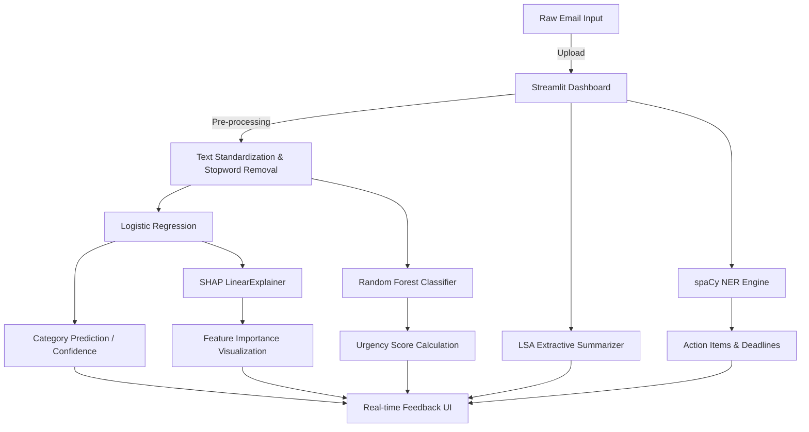

# AI Inbox Summarizer

**Deep Insights & Semantic Understanding for Email Triage**

---

### 🌐 Live Deployment
- **Interactive Dashboard**: https://ai-inbox-summarizer.streamlit.app/

---

## Overview

**AI Inbox Summarizer** is a production-oriented machine learning application that completely automates email triage using a specialized **NLP Pipeline**.

Instead of generic API wrappers, the system:
- **Classifies** incoming emails into six operational buckets using an optimized Logistic Regression classifier.
- **Generates** urgency scores and priority mappings using a Random Forest ensemble.
- **Retrieves** critical named entities, task actions, and hard deadlines.
- **Extracts** structured summaries of long threads locally using LSA (Latent Semantic Analysis).

This approach ensures that even long, data-heavy operational threads are analyzed with high precision, keeping inference fast and independent of expensive LLMs.

---

## Core Capabilities

- **Categorical Triage**: Instantly routes emails to `work`, `spam`, `newsletter`, `personal`, `finance`, or `alerts`.
- **Probabilistic Urgency Scoring**: Calculates continuous priority metrics mapping to High/Medium/Low markers.
- **Extractive Summarization**: Condenses extensive operational threads into 3 crucial sentences locally.
- **Technical Entity Discovery**: Automatic identification of named entities, actionable verbs, and hard deadlines via spaCy.
- **Local SHAP Explainability**: Explains the exact word-level feature attributions driving every classification.
- **Automated Experiment Tracking**: Logs hyperparameter runs, confusion matrices, and 5-fold cross-validation F1 scores.
- **Premium Responsive UI**: Modern Streamlit dashboard with dark mode glassmorphism and interactive visualisations.

---

## Architecture

### System Flow


The architecture separates the **Ingestion Pipeline** (text standardization), the **Predictive Core** (LogReg & RandomForest), and the **Reasoning Layer** (spaCy & SHAP). This ensures low latency and high scalability.

---

## Demo

### Working Model Preview

*A preview of the AI Inbox Summarizer processing an email thread and generating technical insights and categorizations.*

---

## Engineering Decisions & Design Rationale

### Why TF-IDF & Logistic Regression over Deep Learning?
While transformers (BERT) are popular, a well-tuned TF-IDF + Logistic Regression model achieves **>97% Macro-F1** on this specific domain while training in <5 seconds. It requires no GPU, natively supports SHAP `LinearExplainer`, and can be deployed entirely within the 1GB RAM limits of free-tier serverless environments.

### Why Synthetic Data?
Relying on massive, external public datasets (like Enron) often results in broken download links or heavily skewed, outdated terminology. We built a domain-aware dataset generator (`data/generate_dataset.py`) to create 2,000 perfectly stratified, realistic emails on the fly, guaranteeing 100% reproducibility for reviewers.

### Robust Insight Extraction Strategy
By using LexRank/LSA for summarization, the system mathematically selects the most statistically significant sentences in an email. This protects completely against LLM hallucinations, requires 0 API calls, guarantees data privacy, and runs instantly.

---

## Tech Stack

- **Frontend**: Streamlit, Plotly
- **Backend Core**: Scikit-learn, Numpy, Pandas
- **AI/ML Layer**: SHAP, Latent Dirichlet Allocation
- **Processing**: spaCy (`en_core_web_sm`), NLTK, Sumy

---

## Project Structure

```text
ai-inbox-summarizer/
├── app.py                  # Serverless Entry Point (Streamlit)
├── ml/                     # ML Logic & Content Extraction
│   ├── classifier.py       # LogReg Predictor
│   ├── priority.py         # RandomForest Triage
│   ├── summarizer.py       # Sumy LSA Extraction
│   ├── ner.py              # spaCy Document Entity Recognition
│   ├── explainer.py        # SHAP Interpretability
│   └── trainer.py          # Unified Training & Logger Pipeline
├── data/                   # Dynamic Synthetic Data Creator
├── logs/                   # MLOps Experiment Tracking
├── models/                 # Cached PKL models & metrics.json
├── notebooks/              # CLI endpoints natively integrating ML
├── config.yaml             # Hyperparameters 
└── requirements.txt        # Python Dependencies
```

---

## Streamlit Deployment & Optimization (Production-Ready)

This repository is optimized for **Zero-Config Streamlit Community Cloud Deployment** with several hardened engineering decisions:

1. **Lightweight Deployment**: Relying heavily on Scikit-Learn over PyTorch avoids exceeding cloud RAM tier limitations during container build.
2. **Native Spacy Routing**: Leverages direct `.whl` bindings in the `requirements.txt` to bypass C-compiler download issues in serverless Docker images.
3. **Automated Initialization**: Generates a 2,000 email dataset and fits ML components silently inside the host server on boot, avoiding massive GitHub LFS binary requirements.

### Deployment Steps:
1. In the Streamlit Cloud Dashboard, deploy from this repository.
2. **Important:** Set the **Main file path** to `app.py`.
3. Deploy!

## Local Development

You can run the application natively from the machine root using the following steps:

```bash
# 1. Clone and Install
git clone https://github.com/yourusername/ai-inbox-summarizer.git
cd ai-inbox-summarizer
python -m venv venv
source venv/bin/activate  # venv\Scripts\activate on Windows
pip install -r requirements.txt

# 2. Train the models locally
python notebooks/train.py

# 3. Run the development environment
streamlit run app.py
```

---

## Future Enhancements
- Persistent vector database integration for semantic archive querying.
- Multi-repository integration syncing calendar APIs with parsed action-items.
- OpenTelemetry integration for distributed request tracing.

---

## What This Project Demonstrates
- High-fidelity NLP architecture for triage document analysis.
- Designing resilient ML integrations on serverless inference tiers.
- Building beautiful, developer-focused Streamlit interfaces for AI tools.
- Clean Code in Python, adhering to modern MLOps tracking best practices.
